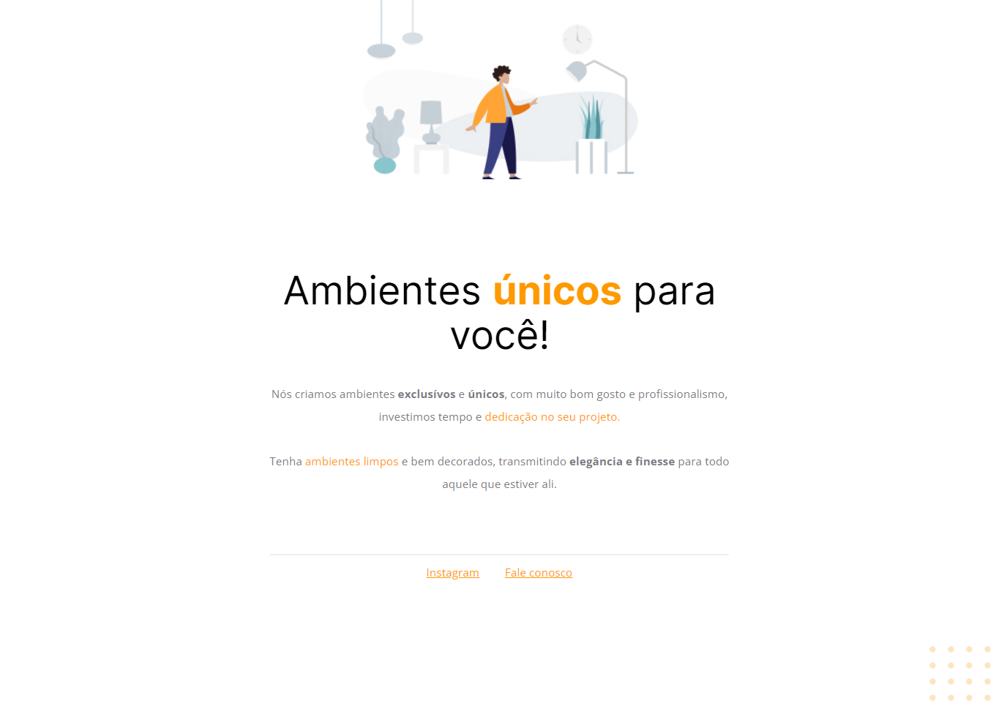

# Explorer Stage 02 - Projeto 01

>Projeto desenvolvido no Stage 02 do programa Explorer da Rocketseat turma 08

>Introdução de alguns conceitos básicos de HTML e CSS em uma aplicação, a partir de um layout pronto no Figma 🎨

## ⚙ Tecnologias
- HTML
- CSS

[🔗 Clique aqui para acessar](https://brunakarina.github.io./projeto-01/)

 ## 🚀 Alguns conceitos aprendidos no Stage 02:
- Estruturando um projeto HTML;
- Uso de tags HTML mais comuns;
- Conceitos iniciais de CSS;
- Posicionamento e alinhamento de elementos na tela;
- Aplicando fontes customizadas;
- Espaçamentos.

## 📫 Contato
- brubskarina@gmail.com